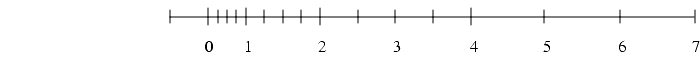

Fighthing my dragons: floating point scares me. 

## Def

(*ensemble des entiers naturels* $\mathbb{N}$*, tel que* $0$ *est le plus petit entire naturel*)

**real numbers**: $\mathbb{Z}$ (*ensemble des entiers relatifs*), integers, infinit but countable (*numberable*) 

(*ensemble des nombre decimaux relatif,* $\mathbb{D}$ *, est un nombre relle qui peut s'ecrire avec une ecriture decimale
limitee, c'est a dire avec une partie entiere et une partie decimale ayant un nombre fini de chiffres apres la virgule.*)

**rational numbers**: $\mathbb{Q}$ (`q` for quotient) , ratio of two real numbers, every rational numbe has a unique representation in lowest term (*fraction irreductible*),achieved
by canceling any common factor in the numerator and denominator.

(*ensemble des reels* $\mathbb{R}$ *incluse les irratonelles, indenombrable*) 


## Representations

$\mathbb{Q}$ can be represented by a ratio of integers $\mathbb{Z}$: a numerator and a denominator, let $x \in \mathbb{Q}$: 

$$
x = \dfrac{a}{b} 
$$

with $a, b \in \mathbb{Z}$ and $b \not= 0$.

### Fixed point 

Fixed = fixed number of numbers after the decimal point. 
eg: US securities have a per security fixed tick size


Data stored is divided into 3 fields : 

- **sign** $S$ 1 bit, positive `0`, negative `1`
- $E$  (*partie entiere*) 
- $F$ (*partie fractionaire*) each deminal binary corresponds to an inverse of the power of 2. The first term (LMB, reading left to right) is $\dfrac{1}{2}$
, second $\dfrac{1}{4}$, $n^{th}$ is $\dfrac{1}{2^{n}}$. 

A fixed point number is: 

$$
(-1)^{S} \times (\sum_{i=0}^{e-1} 2^{i} +\sum_{j=1}^{f} \dfrac{1}{2^{f-j+1}})
$$

Let $e$ be the number of bits in the *partie entiere* and $f$ in the *partie fractionaire*, the range of a fixed point number with is within range:

$$
[2^{e-1} - \dfrac{1}{2^{f}}:-2^{e-1}]
$$

Fixed points numbers are intrensincly limited in the range and precision of numbers they can store. 

**Eg**

$\dfrac{11}{2} (5,5)$ with $e = 15$ and $f = 16$ would written as : 
```
0 000000000000101 1000000000000000
S        E                F
```
 
### Floating point 

The floating point representation is based on the exponential (scientific) notation: 

$$
x = \pm S \times 10^{E}
$$

where numbers are normalized such that $1 \leq S < 10$, $S \in \mathbb{D}$ and $E \in \mathbb{Z}$. 

Analogy: [https://fabiensanglard.net/floating_point_visually_explained/](https://fabiensanglard.net/floating_point_visually_explained/)
- *exponent* == window
- *mantissa* == offset 

**Eg** 

$0.00036525$ is written as $3.6525\times10^{-4}$ using the scientific notation.

We can imagine that the **decimal point floats to the position** immediately after the first nonzero digit 
in the decimal expansion of the number: hence the name floating point.

#### Base 2

In base 2: 

$$
x = \pm S \times 2^{E}
$$

let $1 \leq S < 2$ ($S \in \mathbb{D}$ and $E \in \mathbb{Z}$).

Consequently the binary expansion of $S$ is : 

$$
S =  (b_{0} , b_{1} b_{2} b_{3}  \ldots )_{2} with b_{0} = 1
$$

Given $b_{0} = 1$ we can omit it from being stored and save on 1 bit, this is the hidden bit. 

**Eg** 

Using the same example as for fixed point:

$$
\dfrac{11}{2} = (1 , 011)_{2} \times 2^{2}
$$

#### Precision 

The precision, denoted as $p$ in the floating point system, is the number of bits in the significant $S$, including the hidden bit. 

Any normalized floating point number with precision $p$ can be written as: 

$$
x = \pm (1, b_{1} b_{2}  \ldots  b_{p-1})_{2} \times 2^{E}
$$

Note: the smallest $x$ that is greater than $1$ is: 

$$
(1,000 \ldots 1)_{2} = 1 + 2^{-(p-1)}
$$

we call this smallest step the machine epsilon, notation $\epsilon$ : the gap between this smallest number and 1

$$
\epsilon = (0,000 \ldots 1)_{2} = 2^{-(p-1)}
$$

Let us now define $ulp(x)$, as the gap between $x$ and the next larger/smaller floating point number ($x > 0$/$x < 0$). 

$$
ulp(x) = (0,000 \ldots 1)_{2} \times 2^{E} = \epsilon \times 2^{E}
$$

Note: $ulp(x)$ grows exponentially with $E$, aka: the furter we go from 0, the larger the gap. 



#### Associativity 

> Floating-point arithmetic can only represent a finite subset of the continuum of real numbers. Consequently
certain properties of real arithmetic, such as associativity of addition, do not always hold for floating-point
arithmetic.
~ IEEE 574

If you where felling uneasy, you where right, in the real world, floating point representations 
are not associative, aka, sometimes : $A + (B + C) /not= C + (A + B)$. 

Are you internally crying now? Because I am. 


### IEEE 754

> "MATLAB's creator Dr. Cleve Moler used to advise foreign visitors not to miss the country's two most awesome spectacles: the Grand Canyon, and meetings of IEEE p754."

#### Special numbers 

Since the leading bit of the normalized number $b_{0}$ is hidden, we 
need a special representation for $0$.
And while on the subject of special number representation, we also have a 
sepcial representation for $\infinity$. 

Special numbers on IEEE 754, each of these has a different representation: 
- $0$, $sign = 0, exponent = 0, significant = 0$
- $-0$ (same number as $0$) $sign = 1, exponent = 0, significant = 0$
- $\infty$, result of a divide by $0$ $sign = 0, exponent = max, significant = 0$
- $-\infty$ $sign = 1, exponent = max, significant = 0$
- $NaN$, not a number but an error pattern $sign = ignored, exponent = max, significant =\not 0$


#### Single floating point format: `float32_t`

For the IEEE 754 standard 32 bit float : 

- *sign* $S$ 1 bit, positive `0`, negative `1`
- *exponent* $E$ 8 bits, 
- *mantissa* $M$ 23 bits, also reffered to as the fractional part, 
and if we where being pedantic, since this isn't a logarythmic representation is should really be 
called a **significant**

##### Exponent 

The exponenet field doesn't use a 2's complement representation, but a "biased representation.
The bitstream stores the binary representation of $E+127$. $127$ is added to the desired exponent $E$ 
and is called the "exponent bias". 

Eg: 

$$
1 = (1,000 \ldots 0)_{2} \times 2^{0} = sign=0, exponent=0111 \ldots 111=max-1, signficant=0 
$$

Given the special numbers, the range of the **normalized numbers** 
is between $1_2$ 
and $0111 \ldots 1_2$ or 1 and 254, representing the exponents from 
$[E_{min} = -126 ; E_{max} = 127]$.

Thus the smallest and largest floating point number we can store with f32 is : 

$$
N_{min} = (1,000 \ldots 0)_{2} \times 2^{-126} = 2^{-126} \approx (1,2 \times 10^{-38} )_{10}
$$

$$
N_{max} = (1,111 \ldots 10)_{2} \times 2^{127} = (2-2^{23}) \times 2^{127} \approx (3,4 \times 10^{38})_{10}
$$

##### Subnormals 

Oh yeah, did I mention these don't count as normalized numbers? 

**subnormal** = special 0 exponent bitfield + nonzero fractional bitfield

Eg : 

$$
2^{-127} = (0,1)_{2} \times 2^{-126} = sign=0, exponent=0, significant=(1000 \ldots 0) 
$$

$$
2^{-149} = (0,000 \ldots 01)_{2} \times 2^{-126} = sign=0, exponent=0, significant=(000 \ldots 01)
$$

Subnormal number cannot be normalized since normalization would require an exponent that
does not fit in the field. 

They allow us to represent numbers in the range immediatly bellow the smallest positive
normalized number. 

## Minifloats

Because I have an I/O problem and I like the name, we are going to be doing minifloats, so cute <3 *pat pat*. 

Minifloats commonly describe a floating point number stored on less than 32 bits, this includes the half precision
IEEE 754 float (`fp16`), bfloat16, pixars 24b floating point format, and the time nvidia's marketing team got 
to name a data type or the tensorfloat-32 (which is actually only 19 bits). 

Ideally I would have liked an 8 bit float, but since there isn't a clear standard around such a 
format yet, bfloat it is. 

### bfloat16

Format : 

- **sign** 1 bit
- **exponent** 8 bits (vs 5 bits for fp16)
- **significant** 7 bits (vs 10 bits for fp10), (mantissa) 


Hey? You said "standard", so why not just use fp16? 

Well, because the area of the floating point multiplier scales by the **square of the mantissa** width,
aka, bf16 multiplication cost me half the area of a fp16, oh and I am cheap. 
Having a 16 bit wide format is already going to nuke my bandwidth, so how about I don't also nuke my area budget? 

#### Subnormals 

It is unclear if support for subnormal numbers is needed for bf16. 
On one hand, the RISC-V BF16 extension specifies support for subnormal 
numbers it seems like the tensor flow definition of bf16 does not. 

TPU: Subnormals are flushed to $0$ on bf16.

I really need to unearth where they dumped the corpse of the tensor flow spec for bf16 ...  

## Operations

Floating point values will be represented is the following section using the notations:
 
$$
x = (-1)^{s_x} \dot m_x \dot 2^{e_x}
$$

The following section is based of the 7th chapter of the "Handbook of Floating-Point Arithmetic".

## Addition 

Let an 2 floating point number adder performing: 

$$
r = add(x+y)
= round(norm((−1)^{s_r} · m_r · 2^{e_r}))
$$

### Operations 

#### First steps

1. First, the two exponents $e_x$ and $e_y$ are compared, and the inputs $x$ and
$y$ are possibly swapped to ensure that $e_x ≥ e_y$.
2. A second step is to compute $m_y \dot 2^{−(e_x−e_y)}$ by right shifting $m_y$ by $e_x−e_y$
digit positions (this step is sometimes called *significand alignment*). The
exponent result $e_r$ is tentatively set to $e_x$.
3. The result significand is computed as $m_r = m_x + ( −1)^{s_z} · m_y · 2^{−(e_x−e_y)}$:
either an addition or a subtraction is performed, depending on the signs
$s_x$ and $s_y$. Then if $m_r$ is negative, it is negated. This (along with the signs
$s_x$ and $s_y$) determines the sign $s_r$ of the result. At this step, we have an
exact sum $(−1)^{s_r} · m_r · 2^{e_r}$ .

At this point $r$ is not neceesarily normalized, so we need to do so. 

#### Normalize

Normalization will be required : 

1. If there was a carry in the addition of $m_r$. Since $m_r \lt 2$ is allways true making the carry at
most 1, we must divide $m_r$ by 2: 
    - $m_r$ shift right once
    - $e_r = e_r + 1$ 
2. There was an cancellation in the addition and $m_r < 1$. Let $λ$ be the number of leading zeros of $m_r$:
    - $m_r$ is shifted left by $λ$ digit positions
    - $e_r = e_r − λ$

#### Observations 

##### Significant alignement sizing

The alignment shift need never be by more than $p + 1$ digits ($p$ for precision bits, 
or number of bits in the signification + that one hidden bit) . Indeed,
if the exponent difference is larger than $p + 1$.
$y$ will only be used for computing the sticky bit, and it doesn’t matter that it is not shifted to
its proper place.

##### Normalization alignment

Leading-zero count (LZC) and variable shifting is only needed in case
of a cancellation, i.e., when the significands are subtracted and the exponent 
difference is 0 or 1. But in this case, several things are simpler.
The sticky bit is equal to zero and need not be computed. 
More importantly, **the alignment shift is only by 0 or 1 digit**.

In other words, although two possibly large shifts are mentioned in the
previous algorithm (one for significand alignment, the other one for
normalization in case of a cancellation), they are mutually exclusive.
The literature defines these mutually exclusive cases as the close case
(when the exponents are close) and the far case (when their difference
is larger than 1)

##### Computation of the sticky bit in parallel

In the example above
the normalization step is performed before
rounding: indeed, rounding requires the knowledge of the position of
the round and sticky bits.

However, here again the distinction between the close and far 
rounding cases makes things simpler. 

In the close case, the sticky bit is zero whatever shift the normalization entails. 

In the far case, normalization will entail a shift by at most one digit. 

Classically, the initial sticky bit is therefore computed out of the digits to
the right of the $p + 2$ (directly out of the lower digits of the lesser
addend). The $p + 2$ digit is called the guard digit. 

It will either become the round digit in case of a 1-digit shift, or it will be merged to the
previous sticky bit if there was no such shift.

The conclusion of this is that the bulk of the sticky bit computation can be performed in parallel
with the significand addition.

## Multiplication 

Assuming normal numbers: 

1. $m_r = m_x \times m_y$. Assuming $x$ and $y$ are normal numbers ($1 \leq m_x \lt 2$ and $1 \leq m_y \lt 2$),
then $1 \leq m_r \lt 4$, therefor the significant may need to be shifted to the right by 1 for normalization, and 
$e_r = e_r + 1$ (similar to the far case for addition). 
Since the product of a $p$ sized multiplication is $2p$, the partial sticky bit compute has to be performed on $p-1$ digits (sad). 
2. $e_r = e_x + e_y = (E_x - bias) + (E_y - bias)$ or, we can directly compute the biased exponent of the result 
(before normalization) as $E_x + E_y - bias$.


## Implementation 

### Observations 

#### Adders

Correct adder for the job, different paths have different adder requirements : 
- add: significant addition: on critical path, needs to be as fast as possible while operating on wide data -> tree adder/ carry lookahead 
- mul: exponent addition: small data, can be done in parallel to much more intensive significant multiplicaiton,
not on critical path -> use ripple carry 

## Ressources 

[Great blog post on bflot16](https://nhigham.com/2020/06/02/what-is-bfloat16-arithmetic/)
[RISC-V BF16](https://docs.riscv.org/reference/isa/unpriv/bfloat16.html)
[BFloat16 wiki](https://en.wikipedia.org/wiki/Bfloat16_floating-point_format)
[TensorFloat-32 is a lie: wiki page](https://en.wikipedia.org/wiki/TensorFloat-32) 
[Alternative floating point format: Making floating point math highly efficient for AI hardware](https://engineering.fb.com/2018/11/08/ai-research/floating-point-math/)
[IEEE 754 visualizer](https://bartaz.github.io/ieee754-visualization/)
Numerical Computing with  IEEE  Floating Point  Arithmetic - Michael  L. Overton
